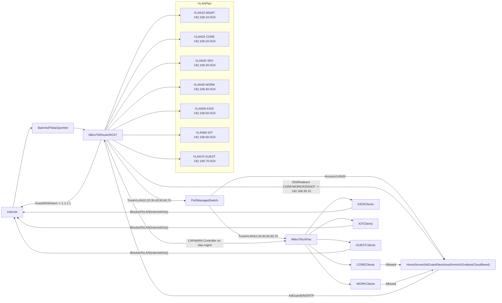

# Homelab Network

Infrastructure-as-code style baseline for a MikroTik-based homelab network.
Configuration is split into ordered RouterOS Go-template scripts, with documented manual steps for devices that are UI-driven.

## Architecture



## Principles

- Keep all tracked files non-sensitive.
- Use placeholders in scripts and docs.
- Keep each router script single-purpose and ordered.
- Document rollback for every apply step.
- Stop at logical checkpoints during first hardware bring-up.

## Repository Layout

- `router/`: ordered RouterOS scripts (`01` to `14`)
- `ap/`: CAP bootstrap script template
- `switch/`: manual switch runbook and rollback notes
- `docs/network-plan.md`: apply, verify, rollback runbook
- `scripts/apply-all.sh`: optional orchestrator for ordered script execution
- `secrets.env.example`: environment variable contract template
- `secrets.env`: local secret file (ignored by git)

## Startup

### Prerequisites

- `ssh`, `scp`, `bash`
- `go` (used locally to render `.rsc` templates before import)
- Router reachable on management network
- Physical access method available for first bring-up (console cable, safe-mode process, or direct LAN fallback)

### 1) Generate SSH key pair (local machine)

```bash
ssh-keygen -t ed25519 -f ~/.ssh/homelab_router -C "homelab-router-admin"
```

### 2) Install public key on router

Use your preferred one-time onboarding flow (password + copy key, serial onboarding, or equivalent).
Only distribute the public key (`.pub`) through docs or runbooks. Never store private keys in this repository.

### 3) Verify key authentication

```bash
ssh -i ~/.ssh/homelab_router admin@<ROUTER_MGMT_IP> ":put \"ssh-key-login-ok\""
```

### 4) Prepare local secrets file

```bash
cp secrets.env.example secrets.env
chmod 600 secrets.env
```

Fill `secrets.env` with real values locally. Do not commit it.

### 5) First connectivity preflight

```bash
./scripts/apply-all.sh --dry-run
```

This validates required variables and confirms your run command path before any changes are sent to hardware.

## Secrets Management

### Current method

- Local `secrets.env` file loaded by `scripts/apply-all.sh`.
- Placeholder values only in tracked files.

### Future method (roadmap)

- Integrate 1Password CLI (`op`) to inject variables at runtime.
- Keep file-based fallback for emergency/manual operation.

## Apply Workflow

### Recommended first-run flow (new hardware)

1. Apply one script at a time in order.
2. Run verification checks after each script (see `docs/network-plan.md`).
3. Continue only after success criteria are met.
4. Record any deviation in the incident note template.

Router scripts use RouterOS `:local` variables with Go-template values (for example `{{ .WAN_INTERFACE }}`). The apply script renders templates locally using values from `secrets.env` before sending to hardware.

AP scripts follow the same Go-template pattern and can be rendered with:

```bash
set -a && source secrets.env && set +a
go run scripts/render-router-templates.go --src-dir ap --dst-dir .rendered/ap
```

### Optional orchestrated flow

Use `scripts/apply-all.sh` for ordered SSH execution with:

- preflight environment validation
- strict Go-template rendering (`missingkey=error`) before apply
- dry-run mode
- checkpoint/step-stop mode
- restart from a chosen script
- execution logs and status state

Examples:

```bash
# Dry-run full sequence
./scripts/apply-all.sh --dry-run

# Apply from a specific step
./scripts/apply-all.sh --from 07-dhcp.rsc

# Stop after a specific step (checkpoint)
./scripts/apply-all.sh --until 04-clock.rsc

# Pause after every step for manual validation
./scripts/apply-all.sh --pause-each

# Resume from state/last-successful-step.txt
./scripts/apply-all.sh --resume
```

## Recovery Model

- Every numbered script in `router/` must have matching rollback notes in `docs/network-plan.md`.
- If a step fails, stop and execute the documented rollback before continuing.
- If rollback is incomplete, use worst-case recovery path for that step (including physical recovery path).
- If key-based SSH fails during first setup:
  1. regain access by local console/direct LAN,
  2. restore known-good management settings,
  3. verify SSH key login again,
  4. resume from the last successful script.

## Known-Good Checkpoints (Commit Aligned)

- **Checkpoint A**: skeleton + guardrails in place
- **Checkpoint B**: startup and secret contract complete
- **Checkpoint C**: router/AP/switch scaffolds complete
- **Checkpoint D**: apply orchestrator functional
- **Checkpoint E**: hardening + incident runbook complete

## Security and Data Hygiene

- Never commit:
  - credentials
  - private keys
  - identifiable MAC/IP/hostname mappings for your environment
- Use template/env variables such as `ROUTER_PASSWORD`, `WAN_INTERFACE`, `STATIC_LEASE_MAC`.
- Before every commit, review staged changes for accidental sensitive values.

## Contributing Safely

- Keep docs and comments in English.
- Keep scripts idempotent where practical.
- Limit one concern per file.
- Update `docs/network-plan.md` whenever a script changes.
- Add/adjust rollback instructions in the same change set as functional edits.

